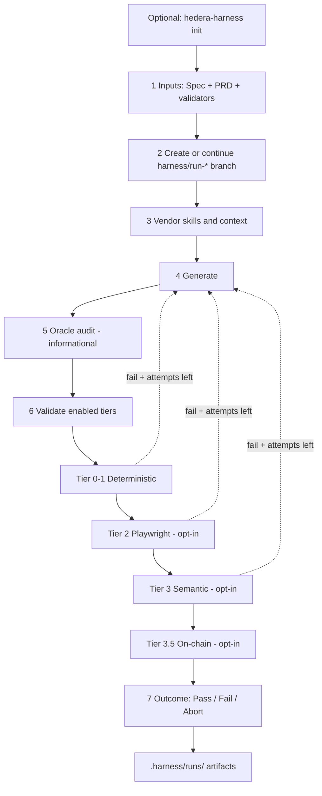

# hedera-harness

TypeScript CLI that **bootstraps and iteratively develops [scaffold-hbar](https://github.com/hedera-dev/scaffold-hbar) projects** from a product brief you supply.

Two main commands:

1. **`init`** — create a new project (seeds scaffold-hbar, fresh `git init`, provisions `.harness/` + generator skills)
2. **`run`** — generate → validate → repair on the **same project cwd**, versioned with `harness/run-*` git branches

The harness is **template-agnostic**. You bring a PRD, a YAML spec, and validators for *your* Hedera demo (HCS feed, tip jar, marketplace, etc.).

## What it does

1. **`init`** clones scaffold-hbar into a project directory, replaces `.git` with a **fresh repo** (no scaffold history/remote), and provisions `.harness/`
2. **`run`** vendors skills/context into ignored runtime paths under `.harness/runtime/`
3. **Creates or continues** a `harness/run-<spec>-<id>` branch with checkpoint commits
4. **Runs a generator agent** (Cursor CLI `agent` by default) against your PRD
5. **Validates** in layers you enable in the spec (see below)
6. **Repairs** on failure with focused prompts, up to `maxAttempts`
7. **Audits** agent logs for oracle peeking (informational — does not fail the run)
8. **Writes artifacts** under `.harness/runs/` for inspection

**Pass condition:** every validation tier enabled in the spec must pass. Oracle audit never blocks a pass.

### Run lifecycle

Happy path (top → bottom). Skip validation tiers that are not enabled in the spec. The dashed edge is the repair loop.



**Branches**

- Validation **fail** + attempts left → repair prompt → back to **Generate**
- Validation **fail** + budget exhausted → **Fail** → stay on harness branch
- Semantic **infra** failure (MCP / browser) → **Abort** (no repair)
- Oracle audit never blocks a pass

### Smart branch detection

| Current branch | Spec | Behavior |
|----------------|------|----------|
| `harness/run-feature-abc` | Same as branch | **Continue** — resume attempts |
| `harness/run-feature-abc` | Different | **New branch** — different feature |
| `main` or other | Any | **New branch** |

Overrides:

```bash
hedera-harness run .harness/spec.yaml --new
hedera-harness run .harness/spec.yaml --continue harness/run-my-feature-abc123
```

## Validation tiers (opt-in via spec)

| Tier | Spec fields | What it checks |
|------|-------------|----------------|
| **0–1 Deterministic** | `validators.static`, `validators.commands`, `requiredFiles`, `forbiddenFiles`, `secretScan` | Files, JSON/text assertions, secrets, yarn install/lint/build (or your commands) |
| **2 Playwright gate** | `validators.playwright` | Dev server boots; configured routes return OK; optional console / forbidden-text checks |
| **3 Semantic** | `contract` + `validator` | Read-only agent drives the live app and grades numbered acceptance assertions |
| **3.5 On-chain** | `chainValidation` (+ Tier 3) | Ephemeral funded ECDSA test signer injected as burner wallet; `executableWithTestSigner` assertions complete real txs and verify via mirror node |

Tier 0–1 is the minimum. Tier 2–3 are optional but recommended for UI demos. Tier 3.5 needs a funded testnet operator on the host.

## Prerequisites

### Always

- **Node.js** >= 20
- **git**
- **yarn** (scaffold-hbar workspaces are Yarn-based)
- **Cursor CLI** (`agent` on your `PATH`, authenticated)

**Install as a CLI dependency** (recommended for consumer projects):

```bash
npm install -D hedera-harness@1.1.1
npx hedera-harness --help
```

Gate 0–1 (deterministic validators) needs only the harness package plus `yaml` — Playwright and the Hedera JS SDK are **optional peer dependencies** and are not installed by default.

**Develop from a clone:**

```bash
git clone https://github.com/hedera-dev/hedera-harness.git
cd hedera-harness
npm install
```

## Quickstart

### 1. Bootstrap a project

```bash
npx hedera-harness init my-app
cd my-app
```

This clones [scaffold-hbar](https://github.com/hedera-dev/scaffold-hbar) `main`, replaces the cloned `.git` with a **fresh repository** (single initial commit, no remote), writes `.harness/` (spec, PRD, validators), copies `skills-index.json`, and pre-vendors generator skills under `.harness/skills/`.

### 2. Edit the recipe

```bash
# Describe your feature
$EDITOR .harness/prd.md
$EDITOR .harness/spec.yaml
# Align validators with the PRD
$EDITOR .harness/validators/static.json
$EDITOR .harness/validators/yarn.json
```

### 3. Run the harness

```bash
npx hedera-harness run .harness/spec.yaml --max-attempts 3
# or: yarn harness:run
```

Creates `harness/run-<spec>-<id>`, runs the attempt loop, and checkpoints each attempt.

### 4. Continue or start a new feature

```bash
# Same branch + same spec after a failed budget → continues automatically
npx hedera-harness run .harness/spec.yaml --max-attempts 3

# Different feature → edit spec name/PRD, then run (new branch)
npx hedera-harness run .harness/other-feature.yaml

# Force a clean slate for the same spec
git checkout main
npx hedera-harness run .harness/spec.yaml --new
```

### Author with agent skills (optional)

Prefer an AI coding agent with the **hedera-harness** plugin from [hedera-skills](https://github.com/hedera-dev/hedera-skills):

```bash
/plugin marketplace add hedera-dev/hedera-skills
/plugin install hedera-harness
# then:
/create-harness-spec
/review-harness-spec
```

Optional inspiration: three **example** PRDs + greenfield specs ship in this repo under `specs/` / `docs/prds/` (historical isolated-run shape). For project-centric work, start from `.harness/` after `init`.

### If you enable Tier 2 (`validators.playwright`)

```bash
npm install -D playwright
npx playwright install chromium
```

### If you enable Tier 3 (`contract` + `validator`)

- An **acceptance contract** JSON
- Playwright MCP available to the Cursor agent
- Validator flags typically: `--force`, `--sandbox disabled`, `--approve-mcps`

### If you enable Tier 3.5 (`chainValidation`)

```bash
npm install -D @hiero-ledger/sdk
export HEDERA_OPERATOR_ID=0.0.xxxx
export HEDERA_OPERATOR_KEY=0x...   # ECDSA private key hex
```

See [`.env.example`](.env.example). The harness does not auto-load `.env`.

## Project layout (after `init`)

```
my-app/
├── .harness/
│   ├── spec.yaml              # no seed; paths relative to project root
│   ├── prd.md
│   ├── validators/
│   │   ├── static.json
│   │   └── yarn.json
│   ├── skills/                # pre-vendored at init (gitignored)
│   ├── runtime/               # session skills/context (gitignored)
│   └── runs/                  # artifacts + session.json (gitignored)
├── skills-index.json
├── packages/
└── ...
```

Required in the **spec file**:

- Omit `seed` — workspace is the project cwd
- `extend.baseline` — host-app health checks before generation (YAML key name kept for compatibility; must include a command literally named `install`)
- Validators / PRD under `.harness/…`

```bash
hedera-harness run .harness/spec.yaml --max-attempts 3
hedera-harness validate
hedera-harness validate .harness/spec.yaml
hedera-harness validate-semantic .harness/spec.yaml
```

## Skills index

Specs should list skills by **name**. The harness resolves those names through [`skills-index.json`](skills-index.json), fetches them from git when needed (cached under `.skill-cache/`), then vendors into `.harness/runtime/skills/` during `run`.

`init` also pre-vendors skills into `.harness/skills/` for offline browsing.

```yaml
skills:
  - hedera-consensus-service
  - project-scaffolding
```

## Configure a project-centric spec

```yaml
name: my-feature
prd: .harness/prd.md

generator:
  provider: command
  command: agent
  args: [ -p, --trust, --sandbox, enabled, --workspace, "{workspace}", --model, composer-2.5, --force, --output-format, stream-json, --stream-partial-output ]
  timeoutMs: 3600000

skills:
  - quality-gates

constraints:
  packageManager: yarn@3.2.3

extend:
  baseline:
    commands:
      - name: install
        command: yarn install
        timeoutMs: 300000

validators:
  static: .harness/validators/static.json
  commands: .harness/validators/yarn.json

requiredFiles:
  - README.md
  - package.json
  - .harness/spec.yaml

forbiddenFiles:
  - .env

maxAttempts: 3

logging:
  jsonl: .harness/runs/harness.log.jsonl
  notes: .harness/runs/harness-notes.md
```

Skeleton source: [`skeletons/project-harness/`](skeletons/project-harness/).

## CLI

```bash
hedera-harness init [target-dir] [--repo URL] [--ref branch] [--template branch] [--skip-install] [--skills a,b]
hedera-harness run [spec] [--max-attempts N] [--new] [--continue <branch>]
hedera-harness validate [spec] [--workspace <path>]
hedera-harness validate-semantic [spec] [--workspace <path>]
```

Default spec for `run`: `.harness/spec.yaml`.

## Repository layout (this package)

```
├── src/                      # Harness implementation
├── skeletons/
│   ├── project-harness/      # Provisioned by `init` into consumer .harness/
│   └── new-template/         # Legacy greenfield authoring stubs
├── skills-index.json
├── specs/                    # Example specs (historical / inspiration)
├── docs/
└── test/
```

## Scripts

| Command | Description |
|---------|-------------|
| `npm run harness -- <cmd>` | Build and run the CLI |
| `npm run build` | Compile TypeScript to `dist/` |
| `npm run typecheck` | Type-check without emitting |
| `npm test` | Build, then run Node test runner suites |
| `npm run smoke:pack` | Pack a release tarball and smoke-install it with Yarn 3 |

CLI commands: `init`, `run`, `validate`, `validate-semantic`.

Published package version **1.1.1** ships `dist/`, `skills-index.json`, and `skeletons/` (see `package.json` `files`).

## Design notes

- **Project-centric** — one git worktree; versioning via `harness/run-*` branches + checkpoint commits
- **Validation is authoritative** — agents do not declare success; the harness does
- **Blind by default** — no reference finished template is passed in
- **Oracle audit** — scans agent logs for access outside the workspace; logged only
- **No auto-push / PR / merge** — completion prints optional next steps only
- **Yarn-only constraints** — typical for scaffold-hbar; encode package-manager rules in the spec

## License

MIT
