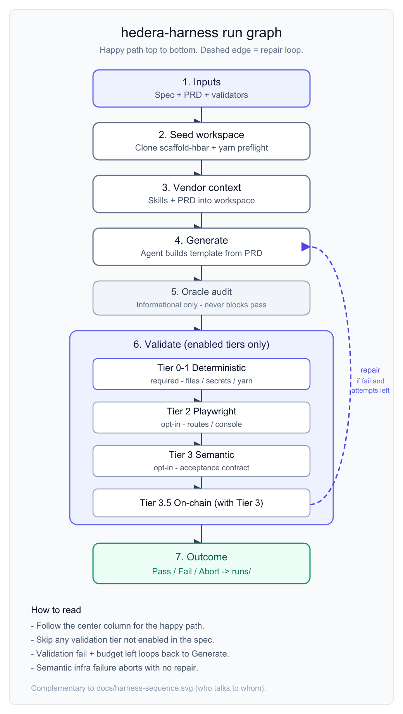
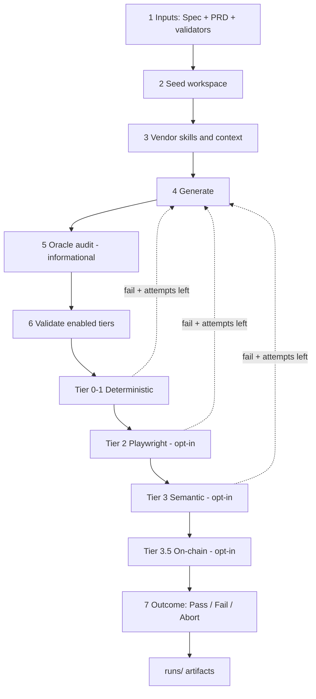
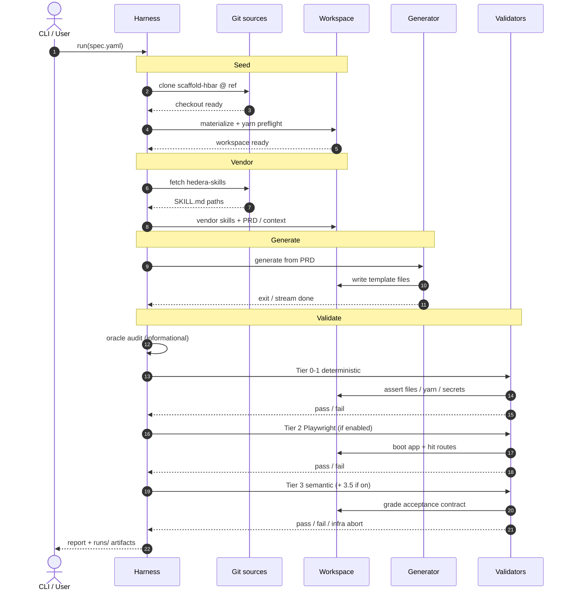

# hedera-harness

TypeScript CLI that **generates and validates [scaffold-hbar](https://github.com/hedera-dev/scaffold-hbar) templates** from a product brief you supply.

The harness is **template-agnostic**. You bring a PRD, a YAML spec, and validators for *your* Hedera demo (HCS feed, tip jar, marketplace, etc.). The loop is always the same: seed → generate → validate → repair until pass or budget exhausted.

## What it does

1. **Seeds** an isolated workspace from a pinned `scaffold-hbar` git ref
2. **Vendors** optional skills and harness context into the workspace
3. **Runs a generator agent** (Cursor CLI `agent` by default) against your PRD
4. **Validates** in layers you enable in the spec (see below)
5. **Repairs** on failure with focused prompts, up to `maxAttempts`
6. **Audits** agent logs for oracle peeking (informational — does not fail the run)
7. **Writes artifacts** under `runs/` for inspection

**Pass condition:** every validation tier enabled in the spec must pass. Oracle audit never blocks a pass.

### Run lifecycle

Happy path (top → bottom). Skip validation tiers that are not enabled in the spec. The dashed edge is the repair loop.



- Vertical graph: [`docs/harness-flow.svg`](./docs/harness-flow.svg) · [`docs/harness-flow.png`](./docs/harness-flow.png)
- Sequence (who talks to whom): [`docs/harness-sequence.svg`](./docs/harness-sequence.svg) · [`docs/harness-sequence.png`](./docs/harness-sequence.png)



**Branches**

- Validation **fail** + attempts left → repair prompt → back to **Generate**
- Validation **fail** + budget exhausted → **Fail** → `runs/`
- Semantic **infra** failure (MCP / browser) → **Abort** (no repair) → `runs/`
- Oracle audit never blocks a pass

When Tier 2 and Tier 3 are both on, they share one dev server. Tier 3.5 injects an ephemeral funded ECDSA signer into the workspace before semantic grading.

<details>
<summary>Detailed sequence diagram (actors / messages)</summary>



</details>

## Validation tiers (opt-in via spec)

| Tier | Spec fields | What it checks |
|------|-------------|----------------|
| **0–1 Deterministic** | `validators.static`, `validators.commands`, `requiredFiles`, `forbiddenFiles`, `secretScan` | Files, JSON/text assertions, secrets, yarn install/lint/build (or your commands) |
| **2 Playwright gate** | `validators.playwright` | Dev server boots; configured routes return OK; optional console / forbidden-text checks |
| **3 Semantic** | `contract` + `validator` | Read-only agent drives the live app and grades numbered acceptance assertions |
| **3.5 On-chain** | `chainValidation` (+ Tier 3) | Ephemeral funded ECDSA test signer injected as burner wallet; `executableWithTestSigner` assertions complete real txs and verify via mirror node |

Tier 0–1 is the minimum. Tier 2–3 are optional but recommended for UI demos. Tier 3.5 needs a funded testnet operator on the host.

## Prerequisites

### Always

- **Node.js** >= 20
- **git** (workspace seeding)
- **yarn** (seeded workspaces are Yarn-based)
- **Cursor CLI** (`agent` on your `PATH`, authenticated)
- A **scaffold-hbar** seed — public remote works; local clone optional
- A **PRD** markdown for the product you want to generate (start from the skeleton — see Quickstart)

```bash
git clone https://github.com/hedera-dev/hedera-harness.git
cd hedera-harness
npm install
```

(SSH works too: `git@github.com:hedera-dev/hedera-harness.git`.)

## Quickstart — build your own idea

The harness is meant for **your** Hedera demo. Copy the skeleton, rewrite placeholders to match `$NAME`, write a PRD, then run:

```bash
NAME=my-hedera-demo

cp skeletons/new-template/prd.md              docs/prds/${NAME}.md
cp skeletons/new-template/spec.yaml           specs/${NAME}.yaml
cp skeletons/new-template/acceptance-contract.json contracts/${NAME}-acceptance.json
cp skeletons/new-template/static.json         validators/${NAME}-static.json
cp skeletons/new-template/yarn.json           validators/${NAME}-yarn.json
cp skeletons/new-template/playwright-smoke.yaml playwright/${NAME}-smoke.yaml

# Align internal paths / names with $NAME (macOS; on Linux drop the '').
sed -i '' "s/my-template/${NAME}/g" \
  specs/${NAME}.yaml \
  validators/${NAME}-static.json \
  validators/${NAME}-yarn.json \
  contracts/${NAME}-acceptance.json \
  playwright/${NAME}-smoke.yaml
```

1. Rewrite `docs/prds/${NAME}.md` for your product (goal, journeys, Hedera services, non-goals).
2. Edit `specs/${NAME}.yaml`: fill remaining `REPLACE_ME` stubs (description, routes). `seed.repo` already defaults to the public [scaffold-hbar](https://github.com/hedera-dev/scaffold-hbar) remote — point it at a local clone only if you prefer.
3. Fill validators (and optionally contract / Playwright) — checklist: [`docs/authoring-a-template.md`](docs/authoring-a-template.md).
4. Run:

```bash
npm run harness -- run specs/${NAME}.yaml --max-attempts 3
```

Optional inspiration: three **example** PRDs + specs ship in the repo (Proof Wall, HTS precompile, x402). Read them to see depth and shape; you do not need to run them. Details: [`docs/prds/README.md`](docs/prds/README.md).

### If you enable Tier 2 (`validators.playwright`)

- Chromium for the harness Playwright dependency:

```bash
npx playwright install chromium
```

### If you enable Tier 3 (`contract` + `validator`)

- An **acceptance contract** JSON (numbered assertions the semantic agent grades)
- Playwright MCP available to the Cursor agent (the harness merges MCP config into the workspace; keep a working Playwright MCP setup for headless runs)
- Validator agent flags that allow MCP tool use in CI/headless contexts, typically:
  - `--force`
  - `--sandbox disabled`
  - `--approve-mcps`

Semantic infrastructure failures (MCP rejected, no browser) abort the repair loop instead of asking the generator to “fix” the app.

### If you enable Tier 3.5 (`chainValidation`)

- A **funded Hedera testnet account created with an ECDSA key** (not ED25519 — ECDSA is required for the EVM address alias used by the burner wallet)
- Export operator credentials in the shell that runs the harness (never write them into a workspace):

```bash
export HEDERA_OPERATOR_ID=0.0.xxxx
export HEDERA_OPERATOR_KEY=0x...   # ECDSA private key hex
```

See [`.env.example`](.env.example) for the full host env reference (including optional `HARNESS_AGENT_IDLE_TIMEOUT_MS`). The harness does not auto-load `.env` — export vars in the shell that runs the CLI.

The harness creates a disposable child account (~`fundingHbar` HBAR), injects its key as `burnerWallet.pk` for the validator, and best-effort sweeps the balance back at run end. See [docs/authoring-a-template.md](docs/authoring-a-template.md) for the full `chainValidation` shape (including optional `deploy` for Solidity templates).

## What you must provide

To benchmark **your** Hedera template, supply:

| Input | Required? | Notes |
|-------|-----------|--------|
| **PRD** (`prd`) | Yes | Markdown under `docs/prds/` — start from [`skeletons/new-template/prd.md`](skeletons/new-template/prd.md); see examples in [`docs/prds/`](docs/prds/) for inspiration |
| **Spec YAML** | Yes | Paths, seed, generator, validators, constraints |
| **Static validator JSON** | Yes | Structural / text / secret assertions for this template |
| **Command validator JSON** | Yes | Yarn (or other) commands that must succeed without live secrets |
| **scaffold-hbar seed** | Yes | Defaults to public `hedera-dev/scaffold-hbar`; override `seed.repo` for a local clone if you prefer |
| **Skills** (`skills`) | Optional | Skill **names** from [`skills-index.json`](skills-index.json) (preferred), or absolute/`./` paths to `SKILL.md` |
| **Playwright smoke YAML** | Tier 2 | `server.command` / `server.url` + routes to hit |
| **Acceptance contract** | Tier 3 | Numbered assertions; source of truth for semantic pass/fail |
| **Validator agent block** | Tier 3 | Separate from the generator; usually stricter MCP/sandbox flags |

Skills default to the public [hedera-dev/hedera-skills](https://github.com/hedera-dev/hedera-skills) repo — no local checkout required. The skeleton / examples also default `seed.repo` to public [hedera-dev/scaffold-hbar](https://github.com/hedera-dev/scaffold-hbar).

### Skills index

Specs should list skills by **name**. The harness resolves those names through [`skills-index.json`](skills-index.json) at the repo root, fetches them from git when needed (cached under `.skill-cache/`), then vendors the matching `SKILL.md` (+ `references/`) into the run workspace under `.harness-skills/`.

Checked-in example specs already include the common Hedera skills. Defaults point at:

```json
"defaults": {
  "repo": "https://github.com/hedera-dev/hedera-skills.git",
  "ref": "master"
}
```

```yaml
skills:
  - hedera-consensus-service
  - project-scaffolding
```

**Add a skill the agent could benefit from:**

1. Open [`skills-index.json`](skills-index.json)
2. Append an entry with a unique `name`, an in-repo `path` under the defaults repo (or a local/`repo` override), and optional `tags` / `description`
3. Reference that `name` in your template spec’s `skills:` list

```json
{
  "name": "hts-system-contract",
  "path": "plugins/system-contracts/skills/hts-system-contract/SKILL.md",
  "tags": ["hts", "solidity"],
  "description": "HTS precompile patterns in Solidity."
}
```

**Local override** (skip the remote fetch for one skill while developing):

```json
{
  "name": "my-wip-skill",
  "path": "./vendor/my-wip-skill/SKILL.md"
}
```

Absolute paths and `./` / `../` relative paths also work directly in a spec’s `skills:` list (they skip the index). If a name is missing from the index, the harness fails fast and lists the registered skills. First remote resolve needs network + `git`.

## Configure a spec

Example layout (paths are yours to fill in):

```yaml
name: my-hedera-template
prd: docs/prds/my-template.md
# contract: contracts/my-template-acceptance.json   # Tier 3

seed:
  repo: https://github.com/hedera-dev/scaffold-hbar.git   # or a local clone path
  ref: main
  preflight:
    commands:
      - command: yarn install

generator:
  provider: command
  command: agent
  args:
    - -p
    - --trust
    - --sandbox
    - enabled
    - --workspace
    - "{workspace}"
    - --model            # pin model for your agent CLI; examples use Cursor agent + composer-2.5
    - composer-2.5
    - --force
    - --output-format
    - stream-json
    - --stream-partial-output
  timeoutMs: 3600000

# validator:                        # Tier 3 — separate agent
#   enabled: true
#   provider: command
#   command: agent
#   args: [ -p, --trust, --force, --sandbox, disabled, --approve-mcps, --model, composer-2.5, ... ]

# skills:                           # names from skills-index.json
#   - hedera-consensus-service

validators:
  static: validators/my-template-static.json
  commands: validators/my-template-yarn.json
  # playwright: playwright/my-template-smoke.yaml   # Tier 2

requiredFiles:
  - template.json
  - README.md
  - AGENTS.md

forbiddenFiles:
  - .env

maxAttempts: 3

logging:
  jsonl: runs/harness.log.jsonl
  notes: runs/harness-notes.md
```

A checked-in example spec lives in [`specs/`](specs/) — useful for field shape and as optional inspiration. For your own product, start from the skeleton (Quickstart above), not by forking an example.

### Adding a new template

Same as Quickstart: copy [`skeletons/new-template/`](skeletons/new-template/) and follow [`docs/authoring-a-template.md`](docs/authoring-a-template.md). Example PRDs under [`docs/prds/`](docs/prds/) show what a filled brief looks like.

## Run

```bash
# First kick — creates runs/<timestamp>-<spec>/ with workspace/
npm run harness -- run specs/my-template.yaml --max-attempts 3

# Later kick — same project, updated PRD/contract on disk, fresh attempt budget
npm run harness -- run specs/my-template.yaml --continue runs/<run-id> --max-attempts 3
```

### Iterate on one project

One run directory accumulates the whole project:

1. **First kick** — seeds workspace, runs up to `maxAttempts`, writes logs under `runs/<id>/`.
2. **Play with the app** — inspect `runs/<id>/workspace`, tweak locally if you want.
3. **Edit PRD / contract / validators** on disk (harness re-vendors them on continue).
4. **Continue kick** — `--continue runs/<id>` skips re-seed, refreshes context, starts a **continue prompt** (not a cold generate), and gives a **fresh `maxAttempts` budget**. Attempt numbers keep counting globally (4, 5, 6…). Cycle reports land in `reports/cycle-N.json`.

Alias: `run … --workspace runs/<id>/workspace` resolves to the same run directory.

Re-run deterministic (+ Playwright gate if configured) on an existing workspace:

```bash
npm run harness -- validate specs/my-template.yaml --workspace runs/<run-id>/workspace
```

Re-run semantic validation only (requires `contract` + `validator` in the spec):

```bash
npm run harness -- validate-semantic specs/my-template.yaml --workspace runs/<run-id>/workspace
```

## Repository layout

```
├── src/              # Harness implementation
├── specs/            # YAML run configs (examples)
├── skills-index.json # Name → SKILL.md registry (remote hedera-skills by default)
├── validators/       # JSON static + command validators
├── contracts/        # Acceptance contracts (Tier 3)
├── playwright/       # Playwright gate smoke configs (Tier 2)
├── skeletons/        # Copyable stubs for a new template benchmark
├── docs/
│   ├── authoring-a-template.md
│   └── prds/         # Your PRDs + example briefs (private WIP: prds/local/)
├── .skill-cache/     # Cached skill repo checkouts (gitignored)
└── runs/             # Run artifacts (gitignored)
```

## Run artifacts

Each run creates `runs/<timestamp>-<spec-name>/`:

| Path | Contents |
|------|----------|
| `workspace/` | Seeded base + agent modifications |
| `prompts/` | Generator, repair, and validator prompts |
| `logs/` | Agent streams, validation, Playwright gate, semantic results |
| `cache/` | Cross-attempt caches (e.g. install fingerprint) |
| `reports/report.json` | Final pass/fail, seed SHA, findings |
| `status.json` | Live progress during long runs |

Cross-run logs (append-only):

- `runs/harness.log.jsonl` — structured events
- `runs/harness-notes.md` — human-readable notes

## Scripts

| Command | Description |
|---------|-------------|
| `npm run harness -- <cmd>` | Build and run the CLI |
| `npm run build` | Compile TypeScript to `dist/` |
| `npm run typecheck` | Type-check without emitting |

CLI commands: `run`, `validate`, `validate-semantic`.

## Design notes

- **Validation is authoritative** — agents do not declare success; the harness does.
- **Blind by default** — no reference finished template is passed in; compare outputs manually if you want.
- **Oracle audit** — scans agent logs for access outside the run workspace; logged only.
- **Yarn-only constraints** — typical for scaffold-hbar; encode package-manager rules in the spec.
- **Repair stays in-workspace** — findings (including semantic assertion IDs when Tier 3 is on) feed a **scoped** repair prompt: semantic-only gaps get assertion `statement` / `howToVerify`; lint/Playwright failures stay runtime-focused.

## License

MIT
